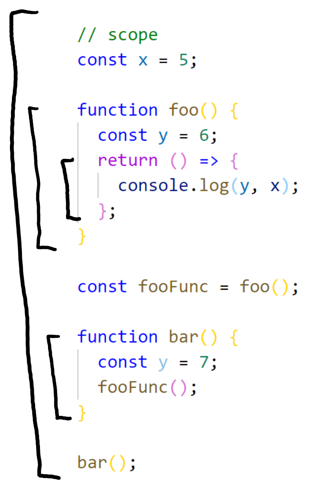

# Scope

Some example code:

```javascript
const x = 5;

function foo() {
  const y = 6;
  return () => {
    console.log(y, x);
  };
}

const fooFunc = foo();

function bar() {
  const y = 7;
  fooFunc();
}

bar();
```

Logs "5 6", not "7, 6" or "undefined, 6", why?



The same code, with scopes drawn as brackets. The arrow function will look in its own, local scope, and then its parent scope. You might think it's the parent scope at execution time (so the `bar` scope where y equals 7), but it's actually the `foo` scope. Function scopes don't change when moving references to the function into other scopes (like we're doing with `fooFunc` here).

If you're confused about scopes, try imagining your code file with these brackets next to it.
