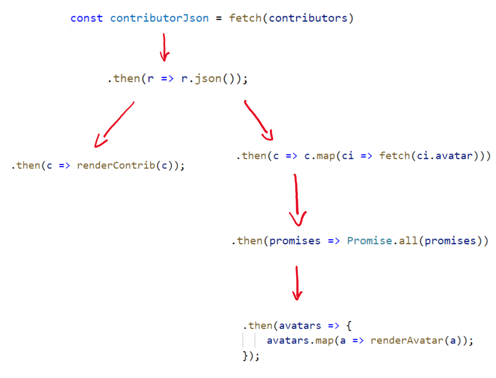

# Promises: chaining `.then()`

I visualize then-chains as a branching structure, like the below code as the tree under it:

```javascript
const contributorJson = fetch(contributors)
  .then(r => r.json());

contributorJson.then(c => renderContrib(c));

contributorJson
  .then(c => c.map(ci => fetch(ci.avatar)))
  .then(promises => Promise.all(promises))
  .then(avatars => {
      avatars.map(a => renderAvatar(a));
  });
```


